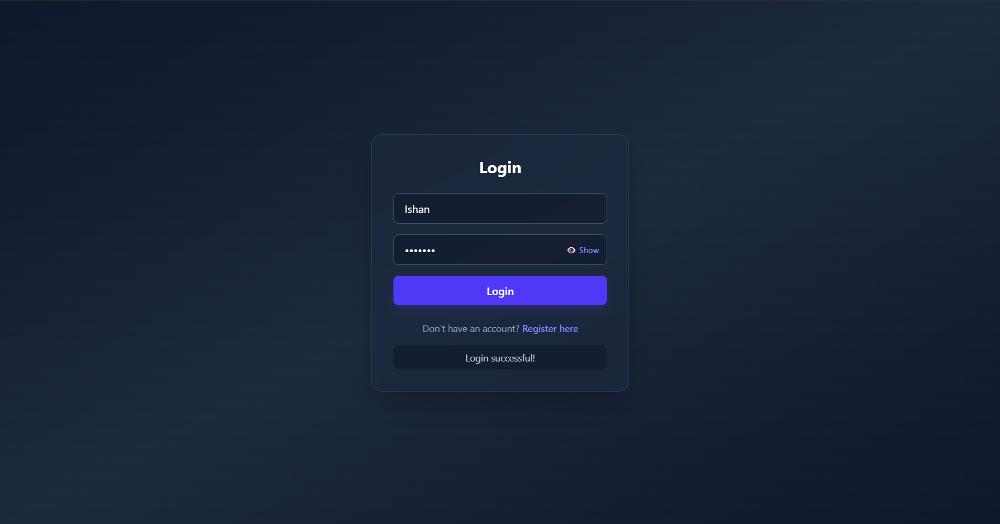
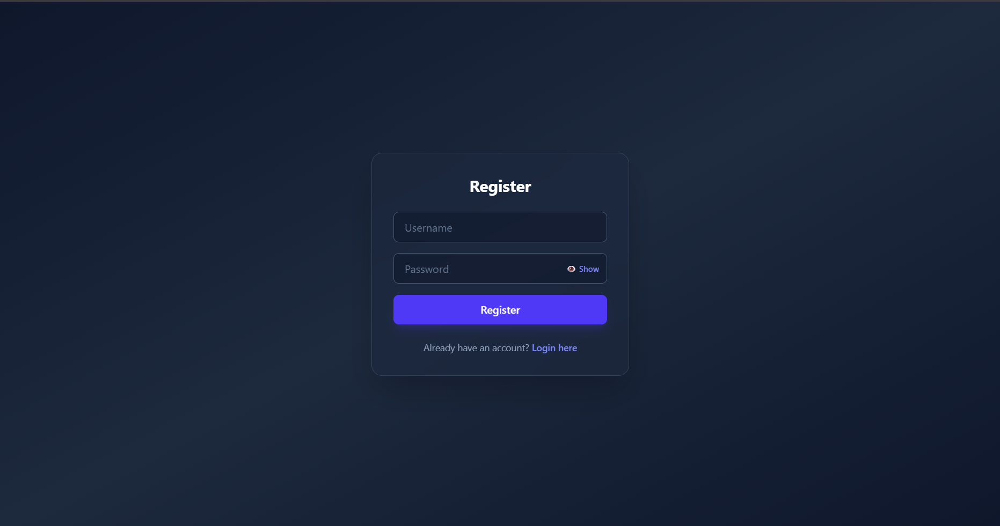
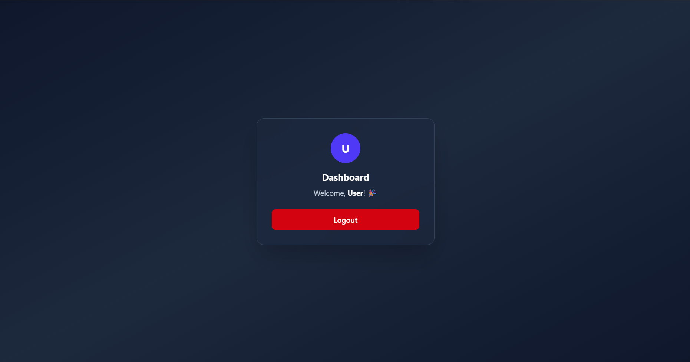

# Secure Login App

A responsive full-stack authentication app with user registration, login, a protected dashboard, logout functionality, and a modern Tailwind CSS interface.

## Live Demo

- Frontend: https://secure-login-app-teal.vercel.app/
- Backend API: https://secure-login-app-lqhw.onrender.com
- GitHub Repository: https://github.com/Ishan-113/secure-login-app

## About the Project

Secure Login App is a full-stack authentication project built to practice real-world login and registration flows. Users can create an account, log in with their credentials, access a protected dashboard, and log out from the session.

The frontend is built with React, Vite, and Tailwind CSS. The backend is built with Node.js and Express, with MongoDB used for storing user accounts and JWT used for protected routes.

## Features

- User registration
- User login
- Protected dashboard
- Logout functionality
- Password show/hide toggle
- Responsive mobile-friendly UI
- Modern Tailwind CSS styling
- Frontend-backend API integration
- Frontend deployed on Vercel
- Backend deployed on Render

## Tech Stack

| Area | Technologies |
| --- | --- |
| Frontend | React, Tailwind CSS, Vite |
| Backend | Node.js, Express.js |
| Database and Auth | MongoDB, Mongoose, JWT, bcryptjs |
| Deployment | Vercel, Render |
| Tools | Git, GitHub, VS Code |

## Screenshots

### Login Page



### Register Page



### Dashboard Page



## Project Structure

```text
secure-login-app/
|-- frontend/
|   |-- screenshots/
|   |   |-- login.png
|   |   |-- register.png
|   |   `-- dashboard.png
|   |-- src/
|   |   |-- App.jsx
|   |   |-- index.css
|   |   `-- main.jsx
|   |-- package.json
|   `-- vite.config.js
|
`-- backend/
    |-- models/
    |   `-- User.js
    |-- server.js
    |-- package.json
    `-- .env
```

## Installation and Setup

Clone the repository:

```bash
git clone https://github.com/Ishan-113/secure-login-app.git
cd secure-login-app
```

Install and run the frontend:

```bash
cd frontend
npm install
npm run dev
```

Install and run the backend:

```bash
cd backend
npm install
npm run dev
```

The frontend runs with Vite. The backend runs with Express on port `5000` for local development.

## Environment Variables

Create a `.env` file inside the backend folder:

```env
MONGO_URI=your_mongodb_connection_string
JWT_SECRET=your_jwt_secret
```

The current frontend version calls the deployed Render API directly. No frontend environment variable is required for the current version.

## API Endpoints

| Method | Endpoint | Description |
| --- | --- | --- |
| GET | `/` | Backend health check |
| POST | `/api/register` | Register a new user |
| POST | `/api/login` | Log in an existing user and return a JWT |
| GET | `/api/profile` | Return protected user profile data |

The `/api/profile` route requires an authorization header:

```http
Authorization: Bearer <token>
```

## What I Learned

- Building a full-stack authentication flow from frontend to backend
- Connecting a React app to an Express API
- Protecting backend routes with JWT authentication
- Hashing user passwords before saving them
- Creating a responsive UI with Tailwind CSS
- Deploying a frontend on Vercel and a backend API on Render

## Future Improvements

- Store JWTs more securely with an improved session strategy
- Add form validation for empty fields and stronger passwords
- Add loading states during login, register, and profile requests
- Add better error messages for failed API requests
- Add a user settings page inside the dashboard

## Author

Ishan Prajapati

- GitHub: https://github.com/Ishan-113
- Portfolio: https://portfolio-ishanp.vercel.app
